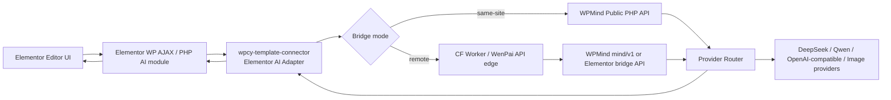

# WPMind × WPCY Connector × Elementor AI 转接方案

Date: 2026-06-08
Owner: wenpai
Agent note: [CX]

## 1. 结论

Elementor AI 转接可行，但不应该把所有逻辑塞进 `wpcy-template-connector` 或 Cloudflare Worker。

推荐分工：

- `wpcy-template-connector`：Elementor 专用适配器，负责拦截 Elementor AI 请求、识别端点、转换请求、还原 Elementor 期望的响应结构。
- `WPMind`：WordPress 侧 AI 核心，负责 provider 配置、模型路由、文本生成、结构化 JSON、图片生成、用量/预算/审计。
- Cloudflare Worker：可选边缘层，负责鉴权、限流、租户路由、日志中继，不承载核心模型逻辑。
- Kali 逆向数据：作为 contract fixture，验证 Connector 返回结构是否满足 Elementor UI。

第一阶段先做 text/code/status/config；第二阶段做 layout；第三阶段做 image generation/editing。

## 2. 当前证据

### 2.1 Elementor AI 侧

已有 Connector 方案文档：

- `/home/parallels/Projects/wpcy-template-connector/docs/elementor-ai-proxy-plan.md`

已确认的 Elementor AI 方向：

- Elementor AI 基础地址：`https://my.elementor.com/api/v2/ai/`
- WordPress/PHP 侧通过 Elementor Connect 请求远端 API。
- 前端 UI 主要调用 WordPress AJAX actions，例如 text completion、custom code、layout generation。
- WPCY Template Connector 已有类似模板库拦截模式，可复用到 AI API，但必须限定到 `/api/v2/ai/*`。
- Kali 已捕获多类请求，包括 status/config、text/code、layout、history、text-to-image、image-to-image multipart variants。
- 当前缺口是官方成功响应体不足，因为本地 mock Connect token 会导致官方上游返回 `400 invalid_connect_data`。

### 2.2 WPMind 侧

WPMind 项目定位是 WordPress AI 服务桥接层，适合作为 Elementor AI 转接的后端核心。

已具备能力：

- 公共 API helper：`wpmind_chat()`、`wpmind_generate_image()`、`wpmind_structured()`、`wpmind_vision()`。
- `PublicAPI` facade：统一暴露 chat、image、vision、stream、structured、batch、embed 等能力。
- `ChatService`：OpenAI-compatible chat/completions 请求、provider 选择、failover、缓存、hooks、usage 解析。
- `StructuredOutputService`：JSON Schema 约束、JSON 模式、失败重试，适合 layout JSON 生成。
- `ImageService` + `ImageRouter`：已有 text-to-image 路由，支持多 provider。
- `modules/api-gateway`：已有 `mind/v1` OpenAI-compatible REST gateway，支持 Bearer key、quota、budget、transform、route、response transform、audit log。

当前缺口：

- 没有 Elementor 专用 adapter。
- Image provider 统一接口目前只有 `generate(prompt, options)`；缺少 image-to-image/edit/upscale/remove-background/inpainting/outpainting 等统一抽象。
- `StructuredOutputService::validate_schema()` 仍是简化校验，Elementor layout schema 需要更严格的 contract test。
- `mind/v1` 是 OpenAI-compatible gateway，不是 Elementor-compatible gateway；不能直接把 Elementor 请求转发过去后期望原样可用。

## 3. 推荐架构



## 4. 两种集成模式

### 4.1 同站点模式

Connector 检测同站点是否安装并启用 WPMind。

调用方式：

- 文本/代码：`wpmind_chat()`
- Layout JSON：`wpmind_structured()`
- Text-to-image：`wpmind_generate_image()`
- 图片理解/alt/prompt 辅助：`wpmind_vision()`

优点：

- 最快落地。
- 不需要远程基础设施即可验证 Elementor UI 行为。
- API key、provider、预算、审计使用站点内 WPMind 设置。

限制：

- 每个站点都要配置 WPMind provider/key。
- 多站点统一计费和统一风控能力弱。
- 无法天然承载 WenPai SaaS 级别 quota。

### 4.2 远程桥接模式

Connector 把 Elementor AI 请求转为 WenPai bridge 请求，请求可经过 CF Worker，再到 WPMind API Gateway 或专门的 Elementor Bridge API。

优点：

- Provider key 可集中管理。
- 适合 WenPai/WPCY 统一授权、quota、套餐和灰度。
- 可统一收集匿名 endpoint 统计和错误信息。

限制：

- 必须定义租户鉴权、站点授权、额度、日志脱敏、滥用防护。
- 需要更完整的 CF Worker / backend 运维。
- 不能直接使用现有 `mind/v1` 当 Elementor 响应层，仍需要 Elementor schema adapter。

## 5. Elementor endpoint 映射

| Elementor AI endpoint 类型 | Connector 行为 | WPMind 能力 | 状态 |
|---|---|---|---|
| `status/check` | 返回 Elementor UI 需要的订阅/额度状态 | 可参考 `wpmind_get_status()` | 可做 MVP |
| `remote-config/config` | 返回 UI feature flags / model config | Connector 本地配置或远程配置 | 可做 MVP |
| `remote-config/frontend-config` | 返回前端开关与入口配置 | Connector 本地配置或远程配置 | 可做 MVP |
| `status/get-started` | 返回/记录引导状态 | Connector 本地 mock 或远程记录 | 可做 MVP |
| `status/feedback/{responseId}` | 记录反馈 | Connector/Worker/WPMind audit | 可做 MVP |
| `text/completion` | prompt 转 chat | `wpmind_chat()` | 可做 MVP |
| `text/edit` | prompt + selected text 转 chat | `wpmind_chat()` | 可做 MVP |
| `text/get-excerpt` | 摘要/摘录 | `wpmind_chat()` 或 `wpmind_summarize()` | 可做 MVP |
| `text/custom-code` | 生成 JS/HTML/PHP 片段 | `wpmind_chat()`，需安全提示词 | 可做 MVP |
| `text/custom-css` | 生成 CSS | `wpmind_chat()`，需 CSS 专用提示词 | 可做 MVP |
| `text/enhance-image-prompt` | 优化图片提示词 | `wpmind_chat()` | 可做 MVP |
| `text/get-motion-effect` | 生成 motion 参数 | `wpmind_structured()` | 可做 MVP |
| `generate/layout` | 生成 Elementor element tree | `wpmind_structured()` | Phase 2 |
| `generate/generate-json-variation` | 基于现有 JSON 变体 | `wpmind_structured()` | Phase 2 |
| `generate/html-to-elementor` | HTML 转 Elementor JSON | `wpmind_structured()` + sanitizer | Phase 2 |
| `generate/enhance-prompt` | layout prompt 增强 | `wpmind_chat()` | Phase 2 |
| `image/text-to-image` | prompt 转图片 URL/attachment | `wpmind_generate_image()` | Phase 2/3 |
| `image/text-to-image/featured-image` | 生成并设为特色图 | `wpmind_generate_image()` + WP media sideload | Phase 3 |
| `image/image-to-image` | 图生图 | WPMind 缺统一 edit 接口 | 需补齐 |
| `image/image-to-image/upscale` | 放大 | WPMind 缺统一 upscale 接口 | 需补齐 |
| `image/image-to-image/remove-background` | 抠图 | WPMind 缺统一 background removal 接口 | 需补齐 |
| `image/image-to-image/replace-background` | 替换背景 | WPMind 缺统一 edit 接口 | 需补齐 |
| `image/image-to-image/outpainting` | 扩图 | WPMind 缺统一 outpaint 接口 | 需补齐 |
| `image/image-to-image/inpainting` | 局部重绘 | WPMind 缺统一 inpaint/mask 接口 | 需补齐 |
| `image/image-to-image/cleanup` | 清理对象 | WPMind 缺统一 cleanup 接口 | 需补齐 |
| history/favorites | 历史记录/收藏 | WPMind gateway audit 可辅助，但需 Elementor-specific storage | 需设计 |

## 6. Elementor 响应格式策略

Connector 不能把 WPMind 原始响应直接回给 Elementor。必须按 Elementor endpoint 包装。

### 6.1 Text/code 响应

建议返回结构：

```json
{
  "text": "...",
  "responseId": "wpcy-ai-...",
  "usage": {
    "provider": "deepseek",
    "model": "deepseek-chat",
    "prompt_tokens": 0,
    "completion_tokens": 0,
    "total_tokens": 0
  }
}
```

其中 `text` 来自 WPMind `content`。

### 6.2 Layout 响应

建议返回结构：

```json
{
  "text": {
    "elements": []
  },
  "responseId": "wpcy-ai-...",
  "usage": {},
  "baseTemplateId": null,
  "templateType": null
}
```

原则：

- `text.elements` 必须是 Elementor element tree 数组。
- 空数组只适合调试，不适合正式生成。
- 每个元素必须包含 Elementor 需要的 `id`、`elType`、`settings`、`elements` 等字段。
- 输出必须通过 schema 校验和 Elementor 本地导入/渲染验证。

### 6.3 Image 响应

Text-to-image 可先包装成 URL 或 attachment 数据。

需要确认 Elementor UI 对字段名的具体要求，再决定返回：

- image URL
- WordPress attachment ID
- media metadata
- responseId
- usage

Image-to-image 不能只靠 `wpmind_generate_image()`，必须补 provider edit 抽象。

## 7. Connector 需要新增的模块

建议在 `wpcy-template-connector` 新增 Elementor AI adapter，而不是先改 WPMind 主流程。

候选结构：

```text
includes/
  class-wpcy-ai-connector.php
  ai/
    class-elementor-ai-interceptor.php
    class-elementor-ai-router.php
    class-elementor-ai-response-normalizer.php
    class-wpmind-bridge-client.php
    schemas/
      text-completion.response.schema.json
      layout.response.schema.json
      image.response.schema.json
```

职责：

- `Elementor_AI_Interceptor`：只拦截 `https://my.elementor.com/api/v2/ai/*`。
- `Elementor_AI_Router`：按 endpoint 分派到 status/text/layout/image/history。
- `WPMind_Bridge_Client`：同站点调用 `wpmind_*`；远程模式调用 Worker/API。
- `Elementor_AI_Response_Normalizer`：把 WPMind/remote response 包装成 Elementor 期望结构。
- `schemas/`：保存 Kali fixture 推导出的请求/响应 schema。

## 8. WPMind 建议新增的能力

### 8.1 短期不必改 WPMind 主 API

MVP 可由 Connector 直接调用现有公共函数。

### 8.2 中期新增 ElementorBridge service

当 Connector MVP 验证通过后，可在 WPMind 增加专用服务：

```text
includes/API/Services/ElementorBridgeService.php
modules/elementor-bridge/
  ElementorBridgeModule.php
  includes/ElementorRequestMapper.php
  includes/ElementorResponseMapper.php
  includes/LayoutSchema.php
  includes/ImageEditRouter.php
```

职责：

- 保存 Elementor prompt templates。
- 保存 Elementor layout schemas。
- 将 Elementor endpoint 转换为 WPMind internal request。
- 提供可选 REST route：`/wp-json/mind/v1/elementor-ai/*`。

### 8.3 图像编辑统一接口

给 WPMind image provider 增加能力枚举和统一 edit API：

```php
interface ImageProviderInterface {
    public function generate( string $prompt, array $options = [] ): array;
    public function capabilities(): array;
    public function edit( string $image, string $prompt, array $options = [] ): array;
}
```

候选 capability：

- `text_to_image`
- `image_to_image`
- `upscale`
- `remove_background`
- `replace_background`
- `outpainting`
- `inpainting`
- `cleanup`

## 9. CF Worker 边界

CF Worker 应做：

- 站点授权校验。
- license/quota 查询。
- rate limit。
- request id 注入。
- endpoint routing。
- 脱敏日志。
- 熔断/降级。

CF Worker 不应做：

- Elementor JSON 复杂生成。
- 长 prompt 模板维护。
- provider schema 深度转换。
- 图片二进制长期存储。
- 替代 WPMind 的 provider/router。

## 10. Contract tests

Kali 捕获结果必须固化为测试 fixture。

建议目录：

```text
wpcy-template-connector/tests/fixtures/elementor-ai/
  status-check.request.json
  status-check.response.json
  text-completion.request.json
  text-completion.response.json
  layout-generate.request.json
  layout-generate.response.json
  text-to-image.request.json
  text-to-image.response.json
  image-to-image.multipart.meta.json
```

测试目标：

- 每个 Elementor endpoint 都有请求 fixture。
- Connector mock response 能通过 Elementor UI handler。
- Layout response 的 `text.elements` 非空且能导入 Elementor。
- 错误响应不会让 UI 卡死或按钮无反馈。
- WPMind 返回 WP_Error 时，Connector 返回 Elementor 可理解的错误结构。

## 11. 分阶段计划

### Phase 0：固化逆向数据

- 整理 Kali 捕获文件。
- 标准化 endpoint matrix。
- 标准化 request/response schema。
- 标记官方成功响应是否真实捕获；没有真实成功响应的 endpoint 标记为 inferred。

### Phase 1：Text/code MVP

- Connector 增加 AI 开关。
- 拦截 `/api/v2/ai/status/*`、`remote-config/*`、`text/*`。
- 同站点优先调用 WPMind。
- 无 WPMind 时返回明确错误或使用远程 bridge。
- 完成 Elementor UI 点击验证。

### Phase 2：Layout

- 建立 Elementor layout schema。
- 用 `wpmind_structured()` 生成 element tree。
- 加 validator 和 sanitizer。
- 用本地 Elementor 编辑器导入验证。

### Phase 3：Text-to-image

- 调用 WPMind image router。
- 处理 URL / attachment sideload。
- 验证 Elementor 媒体选择器和画布插入行为。

### Phase 4：Image editing

- WPMind 增加 image edit capabilities。
- Connector 支持 multipart image endpoint。
- 按 upscale、remove-background、replace-background、inpainting/outpainting 分批验证。

### Phase 5：远程 SaaS 化

- CF Worker 接入授权/限流/租户路由。
- WPMind gateway 或 dedicated bridge 接入远程调用。
- 加 usage、quota、billing、audit。

## 12. 关键风险

- Elementor 成功响应 schema 未完整捕获时，layout/image 最容易出现 UI 卡死或 unknown_error。
- image-to-image multipart 字段、文件来源、返回媒体字段不能猜，必须用 fixture 验证。
- 自定义 code/css 生成要加安全提示词，避免生成危险 PHP/JS。
- Provider 返回结构不稳定，Connector 必须做 defensive normalizer。
- 日志不能默认记录完整 prompt、图片 URL 中的敏感 token、用户站点 secret。

## 13. 当前建议

先不动 CF Worker，也不改 WPMind 主 API。

先在 `wpcy-template-connector` 做 Elementor AI Adapter MVP：

1. 开关默认关闭。
2. status/config/text/code 全部走本地 mock + WPMind chat。
3. 用 Kali fixture 做 endpoint contract tests。
4. Elementor 编辑器里逐个按钮验证。
5. 验证 text/code 后再进入 layout。

这样风险最低，也能最快证明 Elementor AI 转接路径是否真实可用。

## 14. DeepSeek Claude Code 配置实测（2026-06-08）

wenpai VM 的 Claude Code 当前使用 DeepSeek Anthropic-compatible 配置：

- `ANTHROPIC_BASE_URL=https://api.deepseek.com/anthropic`
- 默认 fast model：`deepseek-v4-flash`
- 认证使用 Claude Code 配置中的 `ANTHROPIC_AUTH_TOKEN`，文档不记录密钥。

实测结果：

1. 普通 DeepSeek `/v1/chat/completions` 直连未使用本配置；Mac 本机旧 Key 返回 401。
2. wenpai Claude Code 的 DeepSeek Anthropic-compatible `/v1/messages` 调用成功。
3. 第一次生成 Elementor layout 时，DeepSeek 能生成 `section > column > widgets`，但 widget 节点漏了 `elements: []`。
4. 加强 prompt，明确“任何节点都必须包含 id/elType/settings/elements，widget 的 elements 必须是 []”后，生成结果通过基础结构校验。

本次通过的测试输出：

- `/tmp/deepseek_elementor_ai_response_strict.json`
- model：`deepseek-v4-flash`
- root elements：1
- node count：5
- widgets：`heading`、`text-editor`、`button`

结论：

DeepSeek 能理解并生成 Elementor element tree，但必须用严格 prompt + schema validator + normalizer。不能把模型原始输出直接交给 Elementor。
